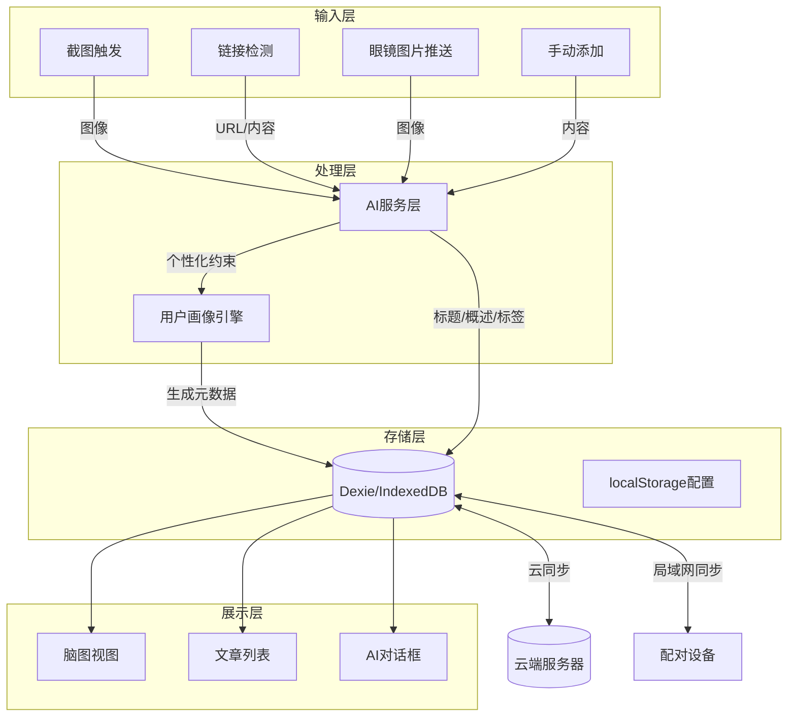
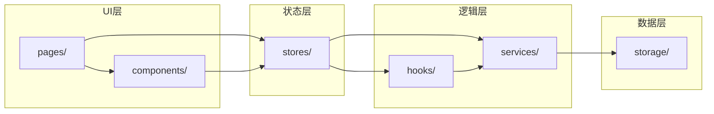

# LifePrompt 系统架构文档

## 1. 技术栈

| 层级 | 技术选型 | 说明 |
|------|----------|------|
| 框架 | React 19 + Vite 6 | 核心UI框架与构建工具 |
| 移动端打包 | Capacitor 8 | 将Web应用打包为Android APK |
| 路由 | react-router-dom v7 | 页面导航管理 |
| 状态管理 | Zustand 5 | 轻量级全局状态，支持持久化 |
| 本地数据库 | Dexie.js (IndexedDB) | 文章、标签、配置等本地存储 |
| UI动画 | Framer Motion | 流畅过渡、弹性反馈、微交互 |
| 图标 | Lucide React | 统一图标库 |
| 主题 | CSS变量 + 类切换 | 支持Light/Night双主题 |
| AI服务 | 原生fetch | 直接调用各模型HTTP API |
| 截图服务 | Capacitor App插件 + 自定义Native插件 | 悬浮窗/通知栏触发截图 |

## 2. 项目目录结构

```
src/
├── main.jsx                    # 入口
├── App.jsx                     # 根组件（路由+主题provider）
├── index.css                   # 全局样式+CSS变量定义
│
├── stores/                     # Zustand状态管理
│   ├── useThemeStore.js        # 主题状态（light/night）
│   ├── useAuthStore.js         # 登录/用户信息
│   ├── useArticleStore.js      # 文章数据CRUD
│   ├── useAIStore.js           # AI模型配置
│   ├── useUserProfileStore.js  # 用户画像/约束文件
│   ├── useSettingsStore.js     # 应用设置（快捷键、同步开关等）
│   └── useUISearchStore.js     # UI搜索/筛选状态
│
├── pages/                      # 页面级组件
│   ├── HomePage.jsx            # 主页：脑图+对话框+文章列表
│   ├── ArticleDetailPage.jsx   # 文章详情
│   ├── ArticleListPage.jsx     # 文章列表（标签/分类筛选）
│   ├── MindMapPage.jsx         # 脑图全屏视图
│   ├── AIChatPage.jsx          # AI对话页面
│   ├── SettingsPage.jsx        # 设置中心
│   ├── AIConfigPage.jsx        # AI模型配置
│   ├── UserProfilePage.jsx     # 用户画像生成
│   ├── ShortcutConfigPage.jsx  # 快捷键设置
│   ├── CloudBackupPage.jsx     # 云备份/登录
│   ├── LANBackupPage.jsx       # 局域网备份
│   ├── PublishPage.jsx         # 发布文章（公众号等）
│   ├── LinkCapturePage.jsx     # 链接识别/添加
│   ├── GlassesInboxPage.jsx    # 眼镜图片收件箱
│   └── OnboardingPage.jsx      # 首次引导
│
├── components/                 # 组件库
│   ├── ui/                     # 基础原子组件
│   │   ├── GlassCard.jsx       # 玻璃态卡片容器
│   │   ├── NeonButton.jsx      # 霓虹按钮（支持发光效果）
│   │   ├── GhostInput.jsx      # 幽灵输入框
│   │   ├── PillTag.jsx         # 胶囊标签
│   │   ├── ToggleSwitch.jsx    # 切换开关
│   │   ├── BottomSheet.jsx     # 底部抽屉
│   │   ├── Toast.jsx           # 轻提示
│   │   ├── Skeleton.jsx        # 骨架屏
│   │   ├── EmptyState.jsx      # 空状态
│   │   ├── ViewToggle.jsx      # 视图切换（三种模式）
│   │   ├── ThemeToggle.jsx     # 主题切换
│   │   └── Modal.jsx           # 通用弹窗
│   │
│   ├── layout/                 # 布局组件
│   │   ├── AppShell.jsx        # 应用外壳（含底部导航）
│   │   ├── BottomNav.jsx       # 底部导航栏
│   │   ├── TopBar.jsx          # 顶部标题栏
│   │   ├── SafeArea.jsx        # 安全区域适配
│   │   └── PageTransition.jsx  # 页面过渡包装器
│   │
│   ├── features/               # 功能组件
│   │   ├── MindMapCanvas.jsx   # 脑图画布（力导向图）
│   │   ├── ChatDialog.jsx      # AI对话对话框
│   │   ├── ArticleCard.jsx     # 文章卡片（三种视图）
│   │   ├── ArticleGrid.jsx     # 文章网格/列表
│   │   ├── SearchBar.jsx       # 搜索栏
│   │   ├── FilterChips.jsx     # 筛选标签组
│   │   ├── FloatingCapture.jsx # 悬浮截图按钮
│   │   ├── LinkDetector.jsx    # 剪贴板链接检测器
│   │   ├── ProfileChat.jsx     # 用户画像对话流程
│   │   ├── PublishFlow.jsx     # 发布流程
│   │   ├── SyncStatus.jsx      # 同步状态指示器
│   │   └── ScanLineBg.jsx      # 扫描线背景（night模式）
│   │
│   └── providers/              # Provider组件
│       ├── ThemeProvider.jsx   # 主题Provider
│       ├── DBProvider.jsx      # 数据库初始化
│       └── ErrorBoundary.jsx   # 错误边界
│
├── hooks/                      # 自定义Hooks
│   ├── useArticles.js          # 文章查询/增删改
│   ├── useTags.js              # 标签管理
│   ├── useAIChat.js            # AI对话流
│   ├── useClipboard.js         # 剪贴板监听
│   ├── useScreenshot.js        # 截图触发
│   ├── useNetwork.js           # 网络状态
│   ├── useDebounce.js          # 防抖
│   ├── useLocalStorage.js      # localStorage封装
│   ├── useAnimation.js         # 动画辅助
│   └── useThemeColors.js       # 获取当前主题色值
│
├── services/                   # 服务层
│   ├── ai/
│   │   ├── index.js            # AI服务统一入口
│   │   ├── openai.js           # OpenAI API封装
│   │   ├── claude.js           # Claude API封装
│   │   ├── qianwen.js          # 通义千问API封装
│   │   ├── promptTemplates.js  # Prompt模板（标题/概述/标签/发布）
│   │   └── profileEngine.js    # 用户画像约束引擎
│   │
│   ├── storage/
│   │   ├── db.js               # Dexie数据库初始化
│   │   ├── articleRepo.js      # 文章仓库
│   │   ├── tagRepo.js          # 标签仓库
│   │   └── settingsRepo.js     # 设置仓库
│   │
│   ├── sync/
│   │   ├── cloudSync.js        # 云端同步
│   │   ├── lanSync.js          # 局域网同步
│   │   └── conflictResolver.js # 冲突解决
│   │
│   ├── capture/
│   │   ├── screenshot.js       # 截图服务
│   │   ├── linkParser.js       # 链接解析/抓取
│   │   └── imageAnalyzer.js    # 图片内容分析
│   │
│   └── publish/
│       ├── wechat.js           # 微信公众号发布
│       └── platformBase.js     # 发布平台基类
│
├── utils/
│   ├── constants.js            # 常量定义
│   ├── helpers.js              # 通用工具函数
│   ├── animations.js           # 动画配置（spring参数等）
│   ├── validators.js           # 表单验证
│   └── mockData.js             # 假数据生成器
│
└── assets/
    ├── fonts/                  # Sora, Space Grotesk
    └── icons/                  # 自定义SVG图标
```

## 3. 核心数据流



## 4. 模块依赖关系



## 5. 关键技术决策

### 5.1 移动端适配策略
- 使用 viewport-fit=cover 适配刘海屏
- CSS safe-area-inset 处理安全区域
- 底部导航固定 64px + safe-area
- 顶部状态栏由 Capacitor StatusBar 插件管理

### 5.2 性能策略
- 文章列表使用虚拟滚动（react-window）
- 图片懒加载 + 缩略图缓存
- Dexie 索引优化：按时间倒序、按标签查询
- 路由懒加载（React.lazy + Suspense）

### 5.3 离线优先
- 所有数据先写本地 IndexedDB
- 云同步在后台静默进行
- AI调用在有网络时进行，结果缓存本地
- 离线时排队，恢复网络后批量处理

### 5.4 安全
- API密钥存储在 localStorage（加密存储可选）
- 敏感操作（删除、发布）二次确认
- 局域网同步使用配对码 + AES加密传输
